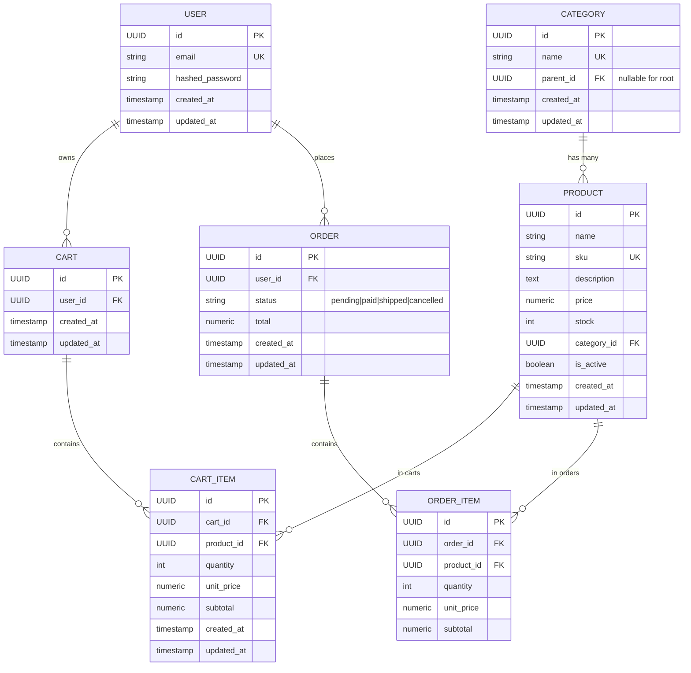

# E-Commerce-API
E-commerce API built with FastAPI & SQLModel — A clean, production-ready REST API for managing products, categories, and orders. Includes async PostgreSQL integration, Alembic migrations, Dockerized database, GitHub Actions CI/CD, and pre-commit hooks. Designed for scalability and best practices in modern Python backend development.

## ✨Features

- FastAPI for high-performance async APIs

- SQLModel + PostgreSQL for ORM and data modeling

- Alembic migrations for database schema management

- Docker & docker-compose for containerized services (PostgreSQL + pgAdmin)

- GitHub Actions CI for linting, type-checking, migrations, and tests

- Pre-commit hooks for code quality (Ruff, mypy)

- Modular folder structure for scalability and maintainability

## 🛠 Tech Stack

- Python 3.12

- FastAPI

- SQLModel

- PostgreSQL (asyncpg)

- Alembic

- Docker & docker-compose

- GitHub Actions

## 🚀 Getting Started
1. Clone repo
```bash
git clone https://github.com/yourusername/ecommerce-api.git
cd ecommerce-api
```

2. Copy env and start DB
```bash
cp .env.example .env
```

3. Start database
```bash
docker compose up -d db pgadmin
```

3. Install deps
```bash
python -m venv .venv
source .venv/bin/activate  # On Windows: .venv\Scripts\activate
pip install -r requirements.txt -r requirements-dev.txt
```

4. Run migrations
```bash
alembic upgrade head
```

5. Start API
```bash
uvicorn app.main:app --reload
```

## 🧪 Running Tests
```bash
pytest
```

## 🧩 ERD (Entity-Relationship Diagram)


## 📜 License
This project is licensed under the MIT License. See [LICENCE](/LICENSE) for details.

