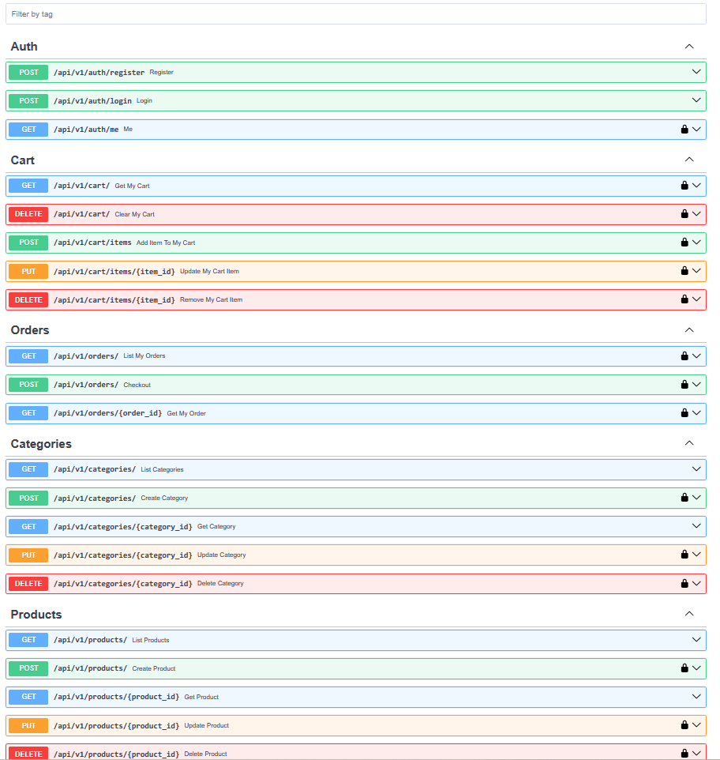
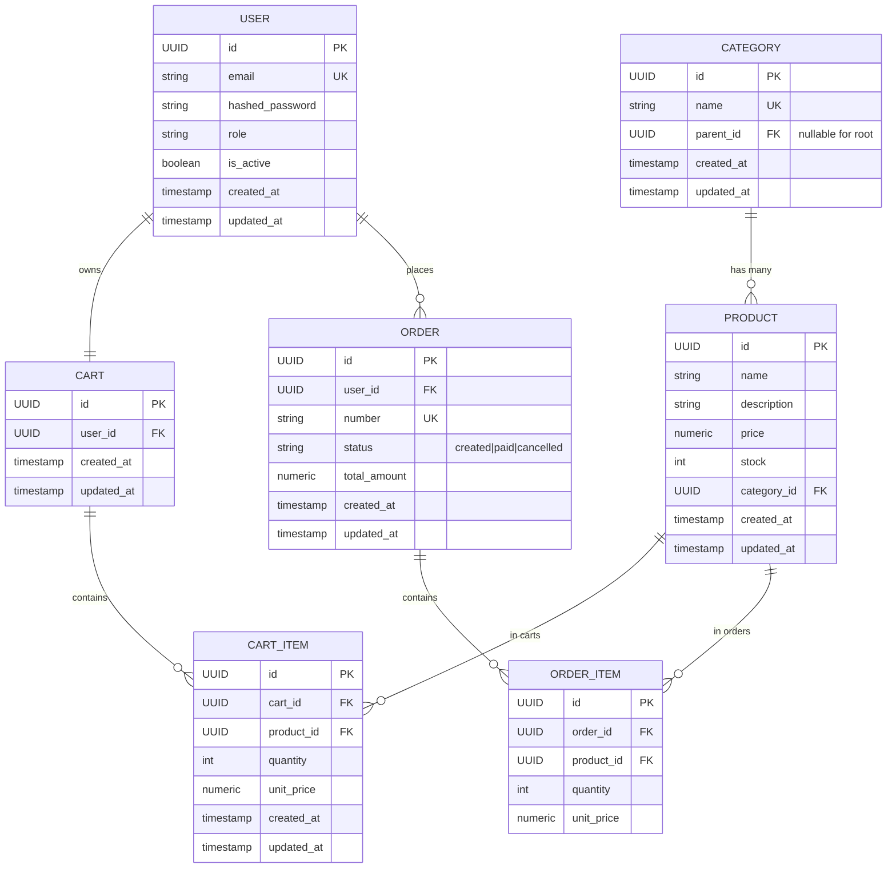

# E-Commerce-API
E-commerce API built with FastAPI & SQLModel — A clean, production-ready REST API for managing products, categories, orders, carts, and user reviews. Includes async PostgreSQL integration, Alembic migrations, Dockerized database, GitHub Actions CI/CD, and pre-commit hooks. Features robust authentication (JWT), user roles (admin/user). Designed for scalability, security, and best practices in modern Python backend development.

## ✨Features

- JWT authentication and user roles (admin/user)
- Product, category, order, cart, and review management
- Full async support

## 🛠 Tech Stack

- Python 3.12
- FastAPI
- SQLModel
- PostgreSQL (asyncpg)
- Alembic
- Docker & docker-compose
- GitHub Actions
- httpx & pytest (for testing)
- pre-commit (for code quality)
- JWT (for authentication)
- Ruff, mypy (if you use them for linting/type-checking)

## ⚡ Prerequisites

- Python 3.12+
- Docker
- (Optional) Git
- (Optional) Make
  
## 🚀 Getting Started
1. Clone repo:
```bash
git clone https://github.com/mouakos/ecommerce-api.git
cd ecommerce-api
```

2. Create .env file:
```bash
cp .env.template .env
```

3. Create a virtual environment:
```bash
python -m venv .venv
```

4. Activate the virtual environment:
On Windows:
```bash
.venv\Scripts\activate
```

On macOS and Linux:
```bash
source .venv/bin/activate
```

5. Install dependencies:
```bash
pip install -r requirements.txt -r requirements-dev.txt
```

## 🚦Usage
1. Start database
```bash
docker compose up -d db pgadmin
```

2. Run alembic migrations:
```bash
alembic upgrade head
```

This will apply any pending database migrations.

3. Start the FastAPI development server:
```bash
uvicorn app.main:app --reload
```

The API will be accessible at http://127.0.0.1:8000/

4. Access the Swagger UI and ReDoc:
    
    - Swagger UI: http://127.0.0.1:8000/api/v1/docs/
    - ReDoc: http://127.0.0.1:8000//api/v1/redoc/


## 🧪 Running Tests

```bash
pytest
```

## 🛠️ Makefile Commands

You can use the provided `Makefile` to simplify common development tasks:

```bash
make help         # List all available make commands
make dev          # Start the development server
make test         # Run the test suite
make mig.new MSG="message"  # Create a new Alembic migration
make migrate      # Apply all migrations
```
See the [Makefile](/Makefile) for more commands and details.

## 🌐 API Endpoints


## 🧩 ERD (Entity-Relationship Diagram)


## 🤝 Contributing
Contributions are warmly welcome! 🌟
- Fork the repository
- Create a new branch (git checkout -b you-branch-name)
- Commit your changes (git commit -m 'feature: Added a cool feature')
- Push to the branch (git push origin your-branch-name)
- Open a Pull Request

Please ensure your code is clean and follows FastAPI's and Pydantic’s best practices.
Let’s learn and build together! 🤝

## 📜 License
This project is licensed under the MIT License. See [LICENSE](/LICENSE) for details.

